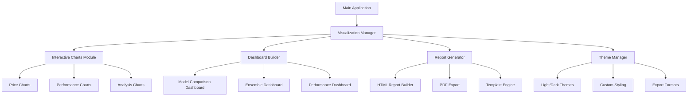

# Advanced Visualization Dashboard Design

## Overview

This design extends the existing stock prediction system with a comprehensive, interactive visualization and reporting dashboard. The current system has basic matplotlib/plotly visualization capabilities, but lacks advanced interactive features, comprehensive dashboards, and professional reporting capabilities that users need for analysis and decision-making.

The enhanced visualization system will provide:
- Interactive charts with real-time data exploration
- Comprehensive performance dashboards
- Advanced model analysis tools
- Professional HTML reports
- Configurable themes and export options
- Modular architecture for easy extension

## Architecture

### High-Level Architecture



### Component Architecture

The visualization system follows a modular, plugin-based architecture:

1. **Visualization Manager**: Central coordinator that manages all visualization components
2. **Chart Factories**: Create specific chart types with consistent interfaces
3. **Dashboard Builder**: Combines multiple charts into comprehensive dashboards
4. **Report Generator**: Creates professional reports with embedded visualizations
5. **Theme System**: Manages styling, colors, and export formats
6. **Configuration Manager**: Handles user preferences and customization

## Components and Interfaces

### 1. Visualization Manager

```python
class VisualizationManager:
    """Central manager for all visualization components."""
    
    def __init__(self, config: Dict[str, Any]):
        self.config = config
        self.theme_manager = ThemeManager(config.get('theme', {}))
        self.chart_factory = ChartFactory(self.theme_manager)
        self.dashboard_builder = DashboardBuilder(self.chart_factory)
        self.report_generator = ReportGenerator(self.theme_manager)
    
    def create_interactive_price_chart(self, data: Dict[str, Any]) -> InteractiveChart
    def create_performance_dashboard(self, metrics: Dict[str, Any]) -> Dashboard
    def create_model_analysis_dashboard(self, analysis: Dict[str, Any]) -> Dashboard
    def generate_comprehensive_report(self, results: Dict[str, Any]) -> Report
```

### 2. Interactive Chart System

```python
class InteractiveChart:
    """Base class for interactive charts with common functionality."""
    
    def __init__(self, chart_type: str, theme: Theme):
        self.chart_type = chart_type
        self.theme = theme
        self.figure = None
        self.callbacks = {}
    
    def add_data_series(self, name: str, data: np.ndarray, style: Dict[str, Any])
    def add_confidence_bands(self, lower: np.ndarray, upper: np.ndarray)
    def add_annotations(self, annotations: List[Dict[str, Any]])
    def set_interactivity(self, zoom: bool, pan: bool, hover: bool)
    def export(self, format: str, path: str)

class PriceChart(InteractiveChart):
    """Interactive price chart with predictions and confidence intervals."""
    
    def add_historical_data(self, dates: pd.Series, prices: pd.Series)
    def add_predictions(self, model_predictions: Dict[str, np.ndarray])
    def add_ensemble_prediction(self, prediction: np.ndarray, confidence: Tuple[np.ndarray, np.ndarray])
    def add_technical_indicators(self, indicators: Dict[str, np.ndarray])
    def enable_model_toggle(self, models: List[str])

class PerformanceChart(InteractiveChart):
    """Interactive performance comparison charts."""
    
    def add_model_metrics(self, metrics: Dict[str, Dict[str, float]])
    def add_time_series_performance(self, performance_over_time: Dict[str, pd.Series])
    def add_residual_analysis(self, residuals: Dict[str, np.ndarray])
    def create_correlation_matrix(self, correlations: np.ndarray, labels: List[str])
```

### 3. Dashboard Builder

```python
class Dashboard:
    """Container for multiple charts with layout management."""
    
    def __init__(self, title: str, layout: str = 'grid'):
        self.title = title
        self.layout = layout
        self.charts = []
        self.metadata = {}
    
    def add_chart(self, chart: InteractiveChart, position: Tuple[int, int])
    def set_layout(self, layout_config: Dict[str, Any])
    def add_summary_panel(self, summary: Dict[str, Any])
    def export_dashboard(self, format: str, path: str)

class DashboardBuilder:
    """Builds comprehensive dashboards from data and configuration."""
    
    def create_model_comparison_dashboard(self, results: Dict[str, Any]) -> Dashboard
    def create_ensemble_analysis_dashboard(self, ensemble_data: Dict[str, Any]) -> Dashboard
    def create_performance_monitoring_dashboard(self, metrics: Dict[str, Any]) -> Dashboard
    def create_feature_analysis_dashboard(self, feature_data: Dict[str, Any]) -> Dashboard
```

### 4. Report Generator

```python
class Report:
    """Professional report with embedded visualizations."""
    
    def __init__(self, title: str, template: str = 'default'):
        self.title = title
        self.template = template
        self.sections = []
        self.metadata = {}
    
    def add_executive_summary(self, summary: Dict[str, Any])
    def add_dashboard(self, dashboard: Dashboard)
    def add_analysis_section(self, title: str, content: str, charts: List[InteractiveChart])
    def add_appendix(self, data: Dict[str, Any])
    def export(self, format: str, path: str)

class ReportGenerator:
    """Generates comprehensive reports with multiple output formats."""
    
    def create_prediction_report(self, results: Dict[str, Any]) -> Report
    def create_performance_report(self, metrics: Dict[str, Any]) -> Report
    def create_model_analysis_report(self, analysis: Dict[str, Any]) -> Report
    def batch_generate_reports(self, batch_data: List[Dict[str, Any]]) -> List[Report]
```

### 5. Theme Management

```python
class Theme:
    """Theme configuration for consistent styling."""
    
    def __init__(self, name: str, config: Dict[str, Any]):
        self.name = name
        self.colors = config.get('colors', {})
        self.fonts = config.get('fonts', {})
        self.layout = config.get('layout', {})
        self.export_settings = config.get('export', {})

class ThemeManager:
    """Manages themes and styling across all visualizations."""
    
    def __init__(self, config: Dict[str, Any]):
        self.themes = self._load_themes(config)
        self.current_theme = self.themes.get(config.get('default', 'light'))
    
    def get_color_palette(self, n_colors: int) -> List[str]
    def get_font_config(self, element: str) -> Dict[str, Any]
    def apply_theme_to_figure(self, figure: Any, chart_type: str)
    def create_custom_theme(self, name: str, config: Dict[str, Any]) -> Theme
```

## Data Models

### Visualization Data Structures

```python
@dataclass
class ChartData:
    """Standard data structure for chart inputs."""
    x_data: Union[np.ndarray, pd.Series]
    y_data: Union[np.ndarray, pd.Series]
    metadata: Dict[str, Any]
    styling: Dict[str, Any] = field(default_factory=dict)

@dataclass
class PredictionData:
    """Data structure for prediction visualizations."""
    historical_data: pd.DataFrame
    predictions: Dict[str, np.ndarray]
    confidence_intervals: Optional[Dict[str, Tuple[np.ndarray, np.ndarray]]]
    ensemble_prediction: Optional[np.ndarray]
    ensemble_confidence: Optional[Tuple[np.ndarray, np.ndarray]]
    metadata: Dict[str, Any]

@dataclass
class PerformanceData:
    """Data structure for performance visualizations."""
    model_metrics: Dict[str, Dict[str, float]]
    time_series_metrics: Optional[Dict[str, pd.Series]]
    backtest_results: Optional[Dict[str, Any]]
    ensemble_weights: Optional[Dict[str, float]]
    feature_importance: Optional[Dict[str, np.ndarray]]

@dataclass
class DashboardConfig:
    """Configuration for dashboard layout and content."""
    title: str
    layout: str  # 'grid', 'tabs', 'accordion'
    charts: List[Dict[str, Any]]
    theme: str
    export_formats: List[str]
    interactivity: Dict[str, bool]
```

### Report Templates

```python
class ReportTemplate:
    """Template for generating structured reports."""
    
    def __init__(self, name: str, config: Dict[str, Any]):
        self.name = name
        self.sections = config.get('sections', [])
        self.styling = config.get('styling', {})
        self.metadata_fields = config.get('metadata', [])
    
    def render_section(self, section_name: str, data: Dict[str, Any]) -> str
    def apply_styling(self, content: str) -> str
    def generate_table_of_contents(self, sections: List[str]) -> str
```

## Error Handling

### Visualization-Specific Exceptions

```python
class VisualizationError(StockPredictorError):
    """Base exception for visualization errors."""
    pass

class ChartCreationError(VisualizationError):
    """Raised when chart creation fails."""
    pass

class DashboardBuildError(VisualizationError):
    """Raised when dashboard building fails."""
    pass

class ReportGenerationError(VisualizationError):
    """Raised when report generation fails."""
    pass

class ThemeError(VisualizationError):
    """Raised when theme operations fail."""
    pass

class ExportError(VisualizationError):
    """Raised when export operations fail."""
    pass
```

### Error Recovery Strategies

1. **Graceful Degradation**: Fall back to simpler visualizations if advanced features fail
2. **Alternative Backends**: Switch between matplotlib/plotly if one fails
3. **Partial Rendering**: Generate partial reports/dashboards if some components fail
4. **Default Themes**: Use built-in themes if custom themes fail to load
5. **Format Fallbacks**: Try alternative export formats if preferred format fails

## Testing Strategy

### Unit Testing

1. **Chart Creation Tests**
   - Test each chart type with various data inputs
   - Verify proper handling of edge cases (empty data, NaN values)
   - Test theme application and styling

2. **Dashboard Building Tests**
   - Test layout algorithms with different chart combinations
   - Verify responsive design and scaling
   - Test export functionality

3. **Report Generation Tests**
   - Test template rendering with various data
   - Verify HTML/PDF output quality
   - Test batch processing capabilities

4. **Theme Management Tests**
   - Test theme loading and application
   - Verify color palette generation
   - Test custom theme creation

### Integration Testing

1. **End-to-End Visualization Pipeline**
   - Test complete flow from prediction results to final report
   - Verify data consistency across all visualization components
   - Test performance with large datasets

2. **Cross-Platform Compatibility**
   - Test visualization rendering on different operating systems
   - Verify export formats work consistently
   - Test browser compatibility for HTML reports

3. **Performance Testing**
   - Benchmark chart creation times with various data sizes
   - Test memory usage during dashboard generation
   - Verify export performance for different formats

### Mock Data and Fixtures

```python
class VisualizationTestFixtures:
    """Test fixtures for visualization components."""
    
    @staticmethod
    def create_sample_prediction_data() -> PredictionData
    
    @staticmethod
    def create_sample_performance_data() -> PerformanceData
    
    @staticmethod
    def create_sample_dashboard_config() -> DashboardConfig
    
    @staticmethod
    def create_mock_theme() -> Theme
```

## Configuration

### Visualization Configuration Schema

```yaml
visualization:
  default_backend: plotly  # matplotlib, plotly
  theme: light  # light, dark, custom
  
  charts:
    price_chart:
      show_confidence_intervals: true
      show_technical_indicators: true
      enable_zoom: true
      enable_pan: true
      hover_info: detailed
    
    performance_chart:
      show_individual_models: true
      show_ensemble: true
      metric_precision: 4
    
    dashboard:
      layout: grid  # grid, tabs, accordion
      responsive: true
      export_formats: [html, png, pdf]
  
  themes:
    light:
      colors:
        primary: "#1f77b4"
        secondary: "#ff7f0e"
        background: "#ffffff"
        text: "#000000"
      fonts:
        title: "Arial, 16px, bold"
        axis: "Arial, 12px"
        legend: "Arial, 10px"
    
    dark:
      colors:
        primary: "#8dd3c7"
        secondary: "#ffd92f"
        background: "#2f2f2f"
        text: "#ffffff"
  
  reports:
    default_template: comprehensive
    include_raw_data: false
    include_code_snippets: false
    
  export:
    dpi: 300
    format_preferences: [html, png, pdf]
    compression: true
```

## Implementation Phases

### Phase 1: Core Interactive Charts (Week 1)
- Implement InteractiveChart base class
- Create PriceChart with confidence intervals
- Add basic interactivity (zoom, pan, hover)
- Implement theme system basics

### Phase 2: Performance Dashboards (Week 2)
- Build PerformanceChart components
- Implement Dashboard container
- Create model comparison dashboard
- Add ensemble analysis dashboard

### Phase 3: Advanced Analysis Tools (Week 3)
- Implement feature importance visualizations
- Add residual analysis charts
- Create correlation matrices
- Build model behavior analysis tools

### Phase 4: Report Generation (Week 4)
- Implement Report and ReportGenerator classes
- Create HTML report templates
- Add PDF export capabilities
- Implement batch report generation

### Phase 5: Polish and Integration (Week 5)
- Add comprehensive error handling
- Implement configuration management
- Create comprehensive test suite
- Performance optimization and documentation

## Performance Considerations

### Optimization Strategies

1. **Lazy Loading**: Load chart data only when needed
2. **Caching**: Cache generated charts and dashboards
3. **Streaming**: Support streaming updates for real-time data
4. **Compression**: Compress exported files to reduce size
5. **Parallel Processing**: Generate multiple charts concurrently

### Memory Management

1. **Data Chunking**: Process large datasets in chunks
2. **Garbage Collection**: Explicit cleanup of large objects
3. **Memory Monitoring**: Track memory usage during generation
4. **Resource Limits**: Set limits on chart complexity and data size

### Scalability

1. **Modular Architecture**: Easy to add new chart types and features
2. **Plugin System**: Support for third-party visualization extensions
3. **API Design**: Clean interfaces for integration with other systems
4. **Configuration Driven**: Behavior controlled through configuration files

This design provides a comprehensive, extensible visualization system that significantly enhances the user experience while maintaining the modular architecture of the existing stock prediction system.