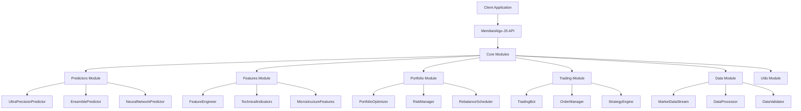

# Design Document

## Overview

The enhanced meridianalgo-js package will be a comprehensive, production-ready financial analysis and algorithmic trading library built on TypeScript. The design focuses on modularity, performance, and ease of use while incorporating ultra-precision machine learning capabilities from our existing Python implementation.

The library will maintain backward compatibility with existing users while providing a clear upgrade path to advanced features. The architecture emphasizes clean separation of concerns, with distinct modules for prediction, feature engineering, portfolio management, and real-time trading.

## Architecture

### High-Level Architecture



### Module Structure

The library will be organized into the following main modules:

1. **Predictors**: Ultra-precision machine learning models
2. **Features**: Advanced feature engineering and technical analysis
3. **Portfolio**: Portfolio optimization and risk management
4. **Trading**: Real-time trading and strategy execution
5. **Data**: Data processing and validation
6. **Utils**: Mathematical utilities and helper functions

## Components and Interfaces

### Core Predictor Components

#### UltraPrecisionPredictor
The main prediction engine that combines ensemble methods with advanced feature engineering.

```typescript
interface PredictorOptions {
  targetErrorRate: number;
  ensembleSize: number;
  featureCount: number;
  trainingRatio: number;
  crossValidationFolds: number;
  hyperparameterTuning: boolean;
  parallelProcessing: boolean;
  cacheFeatures: boolean;
  incrementalLearning: boolean;
  updateFrequency: 'tick' | 'batch' | 'realtime';
  predictionHorizon: number;
  confidenceThreshold: number;
}

class UltraPrecisionPredictor {
  constructor(options: Partial<PredictorOptions>);
  async train(data: TrainingData[]): Promise<void>;
  async predict(features: number[]): Promise<number>;
  async predictBatch(featuresMatrix: number[][]): Promise<number[]>;
  getConfidence(): number;
  getFeatureImportance(): number[];
  getTrainingMetrics(): ModelMetrics | null;
  async saveModel(): Promise<string>;
  async loadModel(modelJson: string): Promise<void>;
}
```

#### FeatureEngineer
Advanced feature generation from market data with 1000+ features capability.

```typescript
interface FeatureOptions {
  targetFeatureCount: number;
  enableAdvancedFeatures: boolean;
  enableMicrostructure: boolean;
  enableVolatilityFeatures: boolean;
  enableStatisticalFeatures: boolean;
  enableHarmonicFeatures: boolean;
  lookbackPeriods: number[];
  technicalIndicators: TechnicalIndicatorConfig;
}

class FeatureEngineer {
  constructor(options: Partial<FeatureOptions>);
  generateFeatures(data: MarketData[]): FeatureMatrix;
  getFeatureNames(): string[];
  getFeatureMetadata(): FeatureMetadata[];
}
```

### Portfolio Management Components

#### PortfolioOptimizer
Modern Portfolio Theory implementation with multiple optimization objectives.

```typescript
interface OptimizerOptions {
  objective: 'sharpe' | 'return' | 'risk' | 'custom';
  constraints: PortfolioConstraints;
  riskModel: 'historical' | 'factor' | 'garch';
  optimizationMethod: 'quadratic' | 'genetic' | 'gradient';
}

class PortfolioOptimizer {
  constructor(options: Partial<OptimizerOptions>);
  optimizePortfolio(data: OptimizationData): OptimalPortfolio;
  calculateEfficientFrontier(data: OptimizationData): EfficientFrontier;
  backtestPortfolio(weights: number[], data: MarketData[]): BacktestResults;
}
```

#### RiskManager
Comprehensive risk analysis and management tools.

```typescript
interface RiskMetrics {
  var: number;
  expectedShortfall: number;
  maxDrawdown: number;
  sharpeRatio: number;
  sortinoRatio: number;
  beta: number;
  alpha: number;
}

class RiskManager {
  calculateMetrics(returns: number[]): RiskMetrics;
  calculatePositionSize(params: PositionSizeParams): number;
  assessPortfolioRisk(weights: number[], data: MarketData[]): RiskAssessment;
  monitorRiskLimits(portfolio: Portfolio): RiskAlert[];
}
```

### Real-time Trading Components

#### TradingBot
Automated trading system with strategy execution and risk management.

```typescript
interface TradingBotConfig {
  strategy: Strategy;
  riskManager: RiskManager;
  dataSource: MarketDataStream;
  executionEngine: OrderManager;
  backtestMode: boolean;
}

class TradingBot {
  constructor(config: TradingBotConfig);
  start(): Promise<void>;
  stop(): Promise<void>;
  getPerformance(): PerformanceMetrics;
  getPositions(): Position[];
  executeStrategy(signal: TradingSignal): Promise<ExecutionResult>;
}
```

#### MarketDataStream
Real-time market data processing and WebSocket management.

```typescript
interface DataStreamConfig {
  symbols: string[];
  intervals: string[];
  sources: DataSource[];
  bufferSize: number;
  reconnectAttempts: number;
}

class MarketDataStream extends EventEmitter {
  constructor(config: DataStreamConfig);
  connect(): Promise<void>;
  disconnect(): Promise<void>;
  subscribe(symbol: string, interval: string): void;
  unsubscribe(symbol: string, interval: string): void;
  getLatestData(symbol: string): MarketData | null;
}
```

## Data Models

### Core Data Types

```typescript
interface MarketData {
  timestamp: Date;
  symbol: string;
  open: number;
  high: number;
  low: number;
  close: number;
  volume: number;
  vwap?: number;
  trades?: number;
}

interface TrainingData extends MarketData {
  features?: number[];
  target?: number;
}

interface FeatureMatrix {
  data: number[][];
  featureNames: string[];
  metadata: FeatureMetadata[];
  columns: number;
  rows: number;
}

interface Prediction {
  value: number;
  confidence: number;
  timestamp: Date;
  features: number[];
  modelVersion: string;
}

interface Portfolio {
  assets: Asset[];
  weights: number[];
  totalValue: number;
  lastRebalance: Date;
  performance: PerformanceMetrics;
}

interface TradingSignal {
  symbol: string;
  action: 'buy' | 'sell' | 'hold';
  quantity: number;
  price: number;
  confidence: number;
  timestamp: Date;
  strategy: string;
}
```

### Configuration Types

```typescript
interface LibraryConfig {
  predictors: PredictorOptions;
  features: FeatureOptions;
  portfolio: OptimizerOptions;
  trading: TradingBotConfig;
  data: DataStreamConfig;
  performance: PerformanceConfig;
}

interface PerformanceConfig {
  enableParallelProcessing: boolean;
  maxWorkers: number;
  cacheSize: number;
  memoryLimit: number;
  enableProfiling: boolean;
}
```

## Error Handling

### Error Hierarchy

```typescript
abstract class MeridianAlgoError extends Error {
  abstract code: string;
  abstract category: 'data' | 'model' | 'trading' | 'system';
}

class DataValidationError extends MeridianAlgoError {
  code = 'DATA_VALIDATION_ERROR';
  category = 'data' as const;
}

class ModelTrainingError extends MeridianAlgoError {
  code = 'MODEL_TRAINING_ERROR';
  category = 'model' as const;
}

class TradingExecutionError extends MeridianAlgoError {
  code = 'TRADING_EXECUTION_ERROR';
  category = 'trading' as const;
}

class SystemError extends MeridianAlgoError {
  code = 'SYSTEM_ERROR';
  category = 'system' as const;
}
```

### Error Handling Strategy

1. **Graceful Degradation**: System continues operating with reduced functionality when non-critical errors occur
2. **Retry Logic**: Automatic retry with exponential backoff for transient errors
3. **Circuit Breaker**: Prevent cascade failures by temporarily disabling failing components
4. **Logging**: Comprehensive error logging with context and stack traces
5. **User Feedback**: Clear, actionable error messages for developers

### Validation Framework

```typescript
class ValidationUtils {
  static validateMarketData(data: MarketData[]): ValidationResult;
  static validateFeatures(features: number[]): ValidationResult;
  static validatePortfolioWeights(weights: number[]): ValidationResult;
  static validateTradingSignal(signal: TradingSignal): ValidationResult;
}

interface ValidationResult {
  isValid: boolean;
  errors: ValidationError[];
  warnings: ValidationWarning[];
}
```

## Testing Strategy

### Test Architecture

1. **Unit Tests**: Individual component testing with 90%+ coverage
2. **Integration Tests**: Module interaction and data flow testing
3. **Performance Tests**: Benchmarking and load testing
4. **Accuracy Tests**: Model prediction accuracy validation
5. **End-to-End Tests**: Complete workflow testing

### Test Categories

#### Unit Tests
- Individual class and method testing
- Mock external dependencies
- Test edge cases and error conditions
- Validate mathematical calculations

#### Integration Tests
- Module interaction testing
- Data pipeline validation
- API contract testing
- Database integration testing

#### Performance Tests
- Latency benchmarking
- Memory usage profiling
- Throughput testing
- Scalability validation

#### Accuracy Tests
- Model prediction accuracy
- Feature engineering validation
- Portfolio optimization results
- Risk calculation verification

### Test Data Management

```typescript
interface TestDataManager {
  generateSyntheticData(config: SyntheticDataConfig): MarketData[];
  loadHistoricalData(symbol: string, period: string): MarketData[];
  createTestPortfolio(assets: string[], weights: number[]): Portfolio;
  mockMarketDataStream(data: MarketData[]): MarketDataStream;
}
```

### Continuous Integration

1. **Automated Testing**: Run all test suites on every commit
2. **Code Quality**: ESLint, Prettier, and TypeScript strict mode
3. **Coverage Reporting**: Maintain 90%+ test coverage
4. **Performance Monitoring**: Track performance regressions
5. **Security Scanning**: Automated vulnerability detection

## Performance Optimization

### Computational Efficiency

1. **Parallel Processing**: Utilize Web Workers for CPU-intensive tasks
2. **Caching**: Intelligent caching of computed features and model results
3. **Lazy Loading**: Load modules and data on-demand
4. **Memory Management**: Efficient memory usage and garbage collection
5. **Algorithm Optimization**: Use optimized mathematical libraries

### Real-time Performance

1. **Streaming Processing**: Process data as it arrives
2. **Incremental Updates**: Update models incrementally rather than full retraining
3. **Connection Pooling**: Efficient WebSocket connection management
4. **Data Compression**: Compress data for faster transmission
5. **Predictive Caching**: Pre-compute likely needed results

### Scalability Considerations

1. **Horizontal Scaling**: Support for distributed processing
2. **Load Balancing**: Distribute computational load across workers
3. **Resource Monitoring**: Track CPU, memory, and network usage
4. **Adaptive Algorithms**: Adjust complexity based on available resources
5. **Cloud Integration**: Support for cloud deployment and auto-scaling

## Security Considerations

### Data Security

1. **Input Validation**: Strict validation of all input data
2. **Sanitization**: Clean and sanitize user inputs
3. **Encryption**: Encrypt sensitive data in transit and at rest
4. **Access Control**: Role-based access to sensitive functions
5. **Audit Logging**: Log all security-relevant events

### API Security

1. **Authentication**: Support for API keys and OAuth
2. **Rate Limiting**: Prevent abuse with request rate limiting
3. **CORS**: Proper Cross-Origin Resource Sharing configuration
4. **HTTPS**: Enforce secure connections
5. **Input Validation**: Validate all API inputs

### Dependency Security

1. **Vulnerability Scanning**: Regular dependency vulnerability checks
2. **Minimal Dependencies**: Use only necessary external libraries
3. **Version Pinning**: Pin dependency versions for reproducibility
4. **Security Updates**: Regular updates for security patches
5. **License Compliance**: Ensure all dependencies have compatible licenses

## Deployment and Distribution

### NPM Package Structure

```
meridianalgo-js/
├── dist/                 # Compiled JavaScript and type definitions
│   ├── index.js         # Main entry point
│   ├── index.d.ts       # TypeScript definitions
│   └── modules/         # Individual module builds
├── examples/            # Usage examples
│   ├── basic/          # Basic usage examples
│   ├── advanced/       # Advanced usage examples
│   └── real-world/     # Real-world scenarios
├── docs/               # Documentation
│   ├── api/           # API documentation
│   ├── guides/        # User guides
│   └── tutorials/     # Step-by-step tutorials
├── src/               # Source code (not included in package)
├── package.json       # Package configuration
├── README.md         # Main documentation
├── LICENSE           # MIT license
└── CHANGELOG.md      # Version history
```

### Build Process

1. **TypeScript Compilation**: Compile TypeScript to JavaScript
2. **Bundle Generation**: Create optimized bundles for different environments
3. **Type Definition Generation**: Generate comprehensive .d.ts files
4. **Documentation Generation**: Auto-generate API documentation
5. **Example Validation**: Ensure all examples work correctly

### Version Management

1. **Semantic Versioning**: Follow semver for version numbering
2. **Changelog**: Maintain detailed changelog for each release
3. **Migration Guides**: Provide migration guides for breaking changes
4. **Deprecation Warnings**: Clear warnings for deprecated features
5. **LTS Support**: Long-term support for major versions

### Quality Assurance

1. **Pre-publish Checks**: Automated quality checks before publishing
2. **Bundle Size Monitoring**: Track and optimize bundle size
3. **Performance Benchmarks**: Maintain performance benchmarks
4. **Compatibility Testing**: Test across different Node.js versions
5. **User Feedback**: Collect and respond to user feedback