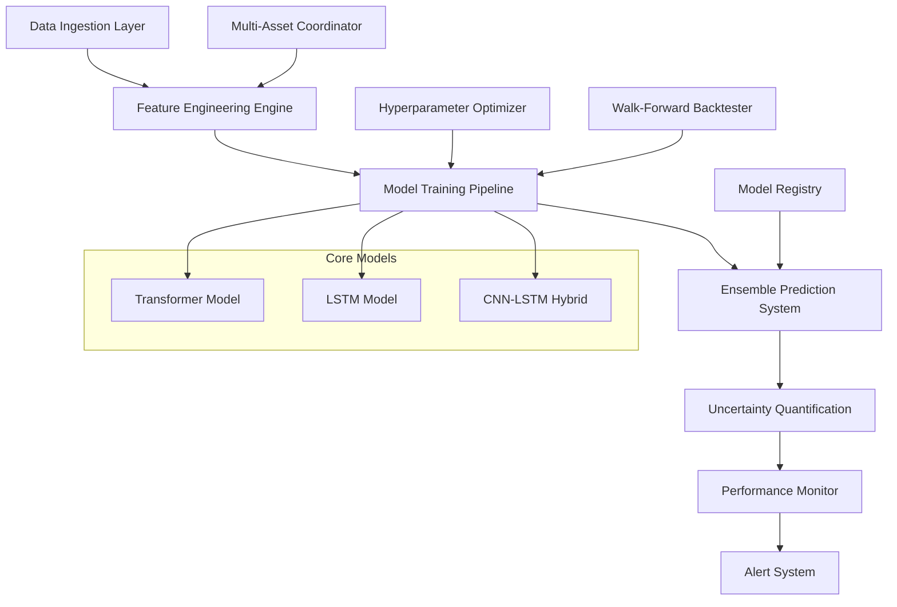

# Design Document

## Overview

The enhanced PyTorch time series prediction system is designed as a comprehensive financial market prediction platform that combines multiple advanced neural network architectures, sophisticated feature engineering, and robust backtesting capabilities. The system aims to achieve ultra-high prediction accuracy through ensemble methods, uncertainty quantification, and adaptive model selection while providing real-time monitoring and automated optimization.

The architecture follows a modular design pattern with clear separation of concerns between data processing, model training, prediction generation, and performance monitoring. This enables easy extension, testing, and maintenance while supporting both single-asset and multi-asset prediction scenarios.

## Architecture

### High-Level System Architecture



### Component Architecture

The system is organized into the following major components:

1. **Data Processing Layer**: Handles data ingestion, cleaning, and preprocessing
2. **Feature Engineering Engine**: Creates advanced technical and microstructure features
3. **Model Architecture Suite**: Multiple neural network implementations
4. **Ensemble System**: Combines predictions from multiple models
5. **Uncertainty Engine**: Quantifies prediction confidence and risk
6. **Backtesting Framework**: Comprehensive historical validation
7. **Monitoring System**: Real-time performance tracking and alerting
8. **Optimization Engine**: Automated hyperparameter tuning

## Components and Interfaces

### 1. Enhanced Model Architecture Suite

#### TimeSeriesTransformer (Enhanced)
```python
class EnhancedTransformer(nn.Module):
    def __init__(self, input_dim, d_model=256, nhead=16, num_layers=8, 
                 seq_len=60, dropout=0.1, use_positional_encoding=True):
        # Multi-scale attention mechanism
        # Learnable positional embeddings
        # Residual connections with layer normalization
        # Adaptive dropout based on uncertainty
```

#### Advanced LSTM Architecture
```python
class AdvancedLSTM(nn.Module):
    def __init__(self, input_dim, hidden_dim=256, num_layers=4, 
                 dropout=0.2, bidirectional=True, attention=True):
        # Bidirectional LSTM with attention mechanism
        # Skip connections between layers
        # Variational dropout for uncertainty estimation
        # Attention-based feature weighting
```

#### CNN-LSTM Hybrid Model
```python
class CNNLSTMHybrid(nn.Module):
    def __init__(self, input_dim, cnn_channels=[64, 128, 256], 
                 lstm_hidden=256, seq_len=60):
        # 1D CNN for local pattern extraction
        # LSTM for temporal dependency modeling
        # Feature fusion layer
        # Multi-scale temporal convolutions
```

### 2. Advanced Feature Engineering Engine

#### Core Feature Categories
- **Price-based Features**: Returns, log returns, price ratios, gaps
- **Technical Indicators**: RSI, MACD, Bollinger Bands, Stochastic, Williams %R
- **Volatility Features**: GARCH-like volatility, realized volatility, volatility clustering
- **Momentum Features**: Multi-timeframe momentum, mean reversion indicators
- **Volume Features**: Volume profile, VWAP, volume-price trend
- **Microstructure Features**: Bid-ask spread proxies, order flow imbalance
- **Cross-asset Features**: Correlation-based features, sector momentum
- **Regime Features**: Market regime indicators, volatility regime detection

#### Feature Engineering Interface
```python
class AdvancedFeatureEngineer:
    def __init__(self, lookback_periods=[5, 10, 20, 50], 
                 technical_indicators=True, microstructure=True):
        
    def create_price_features(self, data) -> np.ndarray:
        # Price-based feature calculations
        
    def create_technical_features(self, data) -> np.ndarray:
        # Technical indicator calculations
        
    def create_microstructure_features(self, data) -> np.ndarray:
        # Market microstructure feature calculations
        
    def create_cross_asset_features(self, multi_asset_data) -> np.ndarray:
        # Cross-asset relationship features
        
    def select_features(self, features, targets, method='mutual_info') -> List[int]:
        # Automatic feature selection based on predictive power
```

### 3. Ensemble Prediction System

#### Ensemble Architecture
```python
class EnsemblePredictionSystem:
    def __init__(self, models: List[nn.Module], weighting_method='performance'):
        self.models = models
        self.weights = None
        self.performance_tracker = ModelPerformanceTracker()
        
    def train_ensemble(self, data, validation_data):
        # Train individual models
        # Calculate ensemble weights based on validation performance
        # Implement stacking or blending techniques
        
    def predict_with_uncertainty(self, data) -> Tuple[float, float, float]:
        # Generate predictions from all models
        # Calculate ensemble prediction
        # Estimate prediction uncertainty
        # Return (prediction, confidence_lower, confidence_upper)
        
    def update_weights(self, recent_performance):
        # Dynamically adjust model weights based on recent performance
```

### 4. Uncertainty Quantification Engine

#### Monte Carlo Dropout Implementation
```python
class UncertaintyQuantifier:
    def __init__(self, model, n_samples=100):
        self.model = model
        self.n_samples = n_samples
        
    def predict_with_uncertainty(self, x) -> Tuple[float, float]:
        # Enable dropout during inference
        # Generate multiple predictions
        # Calculate mean and variance
        # Return prediction and uncertainty estimate
        
    def calibrate_uncertainty(self, validation_data):
        # Calibrate uncertainty estimates using validation data
        # Ensure uncertainty estimates are well-calibrated
```

### 5. Walk-Forward Backtesting Framework

#### Backtesting Architecture
```python
class WalkForwardBacktester:
    def __init__(self, initial_train_size=252, retraining_frequency=21, 
                 test_size=21, min_train_size=126):
        
    def run_backtest(self, data, model_factory, feature_engineer):
        # Implement walk-forward analysis
        # Handle model retraining
        # Track performance across different market regimes
        # Generate comprehensive performance reports
        
    def detect_market_regimes(self, data) -> List[str]:
        # Classify market conditions (bull, bear, sideways)
        # Detect volatility regimes
        # Identify structural breaks
        
    def calculate_regime_performance(self, predictions, actuals, regimes):
        # Calculate performance metrics by market regime
        # Statistical significance testing
```

### 6. Multi-Asset Prediction System

#### Multi-Asset Coordinator
```python
class MultiAssetPredictor:
    def __init__(self, symbols: List[str], correlation_threshold=0.3):
        self.symbols = symbols
        self.correlation_matrix = None
        self.sector_mappings = {}
        
    def create_cross_asset_features(self, data_dict):
        # Calculate cross-correlations
        # Create sector momentum features
        # Generate market-wide indicators
        
    def predict_portfolio(self, data_dict) -> Dict[str, Tuple[float, float]]:
        # Generate predictions for all assets
        # Consider cross-asset relationships
        # Return predictions with confidence intervals
        
    def rank_assets(self, predictions) -> List[Tuple[str, float, float]]:
        # Rank assets by expected return and confidence
        # Consider correlation for portfolio construction
```

## Data Models

### Core Data Structures

#### MarketData
```python
@dataclass
class MarketData:
    symbol: str
    timestamp: datetime
    open: float
    high: float
    low: float
    close: float
    volume: int
    adjusted_close: float
    
    def to_ohlcv(self) -> np.ndarray:
        return np.array([self.open, self.high, self.low, self.close, self.volume])
```

#### PredictionResult
```python
@dataclass
class PredictionResult:
    symbol: str
    timestamp: datetime
    prediction: float
    confidence_lower: float
    confidence_upper: float
    uncertainty: float
    model_contributions: Dict[str, float]
    features_used: List[str]
    
    def to_dict(self) -> Dict:
        return asdict(self)
```

#### PerformanceMetrics
```python
@dataclass
class PerformanceMetrics:
    mae: float
    rmse: float
    directional_accuracy: float
    sharpe_ratio: float
    max_drawdown: float
    hit_rate: float
    profit_factor: float
    regime_performance: Dict[str, Dict[str, float]]
    
    def summary_stats(self) -> Dict[str, float]:
        return {
            'overall_score': self.calculate_composite_score(),
            'risk_adjusted_return': self.sharpe_ratio,
            'consistency': 1.0 - (self.rmse / self.mae)
        }
```

### Database Schema

#### Model Registry
```sql
CREATE TABLE model_registry (
    id INTEGER PRIMARY KEY,
    model_name VARCHAR(100),
    model_type VARCHAR(50),
    hyperparameters JSON,
    performance_metrics JSON,
    training_date TIMESTAMP,
    validation_score FLOAT,
    is_active BOOLEAN
);
```

#### Prediction History
```sql
CREATE TABLE prediction_history (
    id INTEGER PRIMARY KEY,
    symbol VARCHAR(10),
    prediction_date TIMESTAMP,
    prediction_value FLOAT,
    confidence_lower FLOAT,
    confidence_upper FLOAT,
    actual_value FLOAT,
    model_id INTEGER,
    FOREIGN KEY (model_id) REFERENCES model_registry(id)
);
```

## Error Handling

### Comprehensive Error Management

#### Data Quality Validation
```python
class DataQualityValidator:
    def validate_market_data(self, data: pd.DataFrame) -> List[str]:
        errors = []
        
        # Check for missing values
        if data.isnull().any().any():
            errors.append("Missing values detected in market data")
            
        # Check for price anomalies
        if (data['High'] < data['Low']).any():
            errors.append("High prices lower than low prices detected")
            
        # Check for volume anomalies
        if (data['Volume'] < 0).any():
            errors.append("Negative volume values detected")
            
        return errors
```

#### Model Training Error Handling
```python
class ModelTrainingErrorHandler:
    def handle_training_failure(self, model, error: Exception):
        # Log error details
        # Attempt recovery with different hyperparameters
        # Fall back to simpler model architecture
        # Notify monitoring system
        
    def handle_convergence_issues(self, model, loss_history):
        # Detect non-convergence
        # Adjust learning rate
        # Implement gradient clipping
        # Switch optimization algorithm
```

#### Prediction Error Recovery
```python
class PredictionErrorRecovery:
    def handle_prediction_failure(self, model, data, error: Exception):
        # Log prediction failure
        # Attempt with backup model
        # Use ensemble fallback
        # Return uncertainty-weighted historical average
```

## Testing Strategy

### Comprehensive Testing Framework

#### Unit Testing
- **Model Architecture Tests**: Verify forward pass, gradient flow, parameter initialization
- **Feature Engineering Tests**: Validate feature calculations, handle edge cases
- **Data Processing Tests**: Test data cleaning, normalization, sequence creation
- **Utility Function Tests**: Mathematical calculations, statistical functions

#### Integration Testing
- **End-to-End Pipeline Tests**: Full training and prediction workflow
- **Multi-Asset Integration**: Cross-asset feature creation and prediction
- **Backtesting Integration**: Walk-forward analysis with model retraining
- **Ensemble System Tests**: Model combination and weight calculation

#### Performance Testing
- **Scalability Tests**: Performance with large datasets and multiple assets
- **Memory Usage Tests**: Monitor memory consumption during training and inference
- **GPU Utilization Tests**: Verify efficient GPU usage and memory management
- **Latency Tests**: Measure prediction generation time for real-time applications

#### Validation Testing
- **Cross-Validation**: Time series cross-validation with proper temporal splits
- **Out-of-Sample Testing**: Performance on completely unseen data
- **Regime Testing**: Performance across different market conditions
- **Stress Testing**: Performance during market crashes and high volatility periods

#### Test Implementation Strategy
```python
class TestSuite:
    def test_model_architectures(self):
        # Test each model architecture independently
        # Verify gradient flow and parameter updates
        # Test with different input dimensions
        
    def test_feature_engineering(self):
        # Test feature calculations with known inputs
        # Verify feature selection algorithms
        # Test cross-asset feature creation
        
    def test_ensemble_system(self):
        # Test model combination methods
        # Verify weight calculation algorithms
        # Test uncertainty quantification
        
    def test_backtesting_framework(self):
        # Test walk-forward analysis
        # Verify performance metric calculations
        # Test regime detection algorithms
```

### Continuous Integration Pipeline
- **Automated Testing**: Run full test suite on code changes
- **Performance Benchmarking**: Track model performance over time
- **Data Quality Monitoring**: Continuous validation of input data
- **Model Drift Detection**: Monitor for model performance degradation