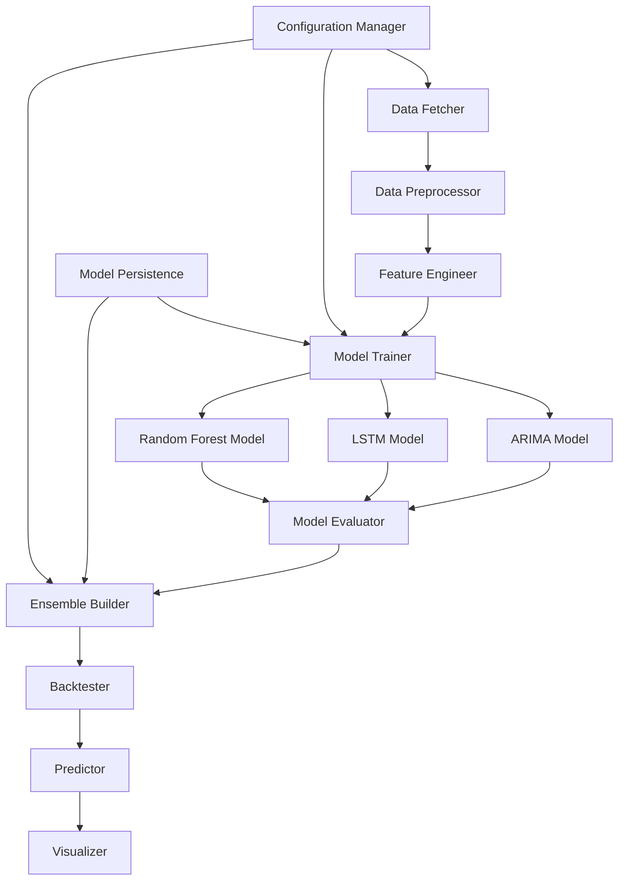

# Design Document

## Overview

The Stock Price Ensemble Predictor is a comprehensive machine learning system that combines multiple forecasting models to predict future stock prices. The system leverages the complementary strengths of ARIMA (linear trends), LSTM (non-linear temporal patterns), and Random Forest (feature-based relationships) to create robust ensemble predictions with confidence intervals.

The architecture follows a modular design with clear separation between data processing, model training, ensemble creation, and prediction visualization components.

## Architecture



The system follows a pipeline architecture where each component has a specific responsibility:

1. **Data Layer**: Handles data acquisition, preprocessing, and feature engineering
2. **Model Layer**: Manages individual model training, evaluation, and persistence
3. **Ensemble Layer**: Combines model predictions and manages dynamic weighting
4. **Evaluation Layer**: Performs backtesting and performance analysis
5. **Presentation Layer**: Generates predictions and visualizations

## Components and Interfaces

### DataFetcher
**Purpose**: Retrieve historical stock data from Yahoo Finance API

**Key Methods**:
- `fetch_stock_data(symbol: str, start_date: str, end_date: str) -> pd.DataFrame`
- `validate_data_completeness(data: pd.DataFrame) -> bool`

**Dependencies**: yfinance library for Yahoo Finance API access

### DataPreprocessor
**Purpose**: Clean and prepare raw stock data for model training

**Key Methods**:
- `handle_missing_values(data: pd.DataFrame) -> pd.DataFrame`
- `normalize_prices(data: pd.DataFrame) -> pd.DataFrame`
- `create_time_splits(data: pd.DataFrame, train_ratio: float, val_ratio: float) -> Tuple`

**Data Transformations**:
- Forward fill for missing OHLC values
- Min-max normalization for price data
- Time-based splitting to prevent data leakage

### FeatureEngineer
**Purpose**: Create technical indicators and lagged features

**Key Methods**:
- `create_moving_averages(data: pd.DataFrame, windows: List[int]) -> pd.DataFrame`
- `calculate_volatility(data: pd.DataFrame, window: int) -> pd.DataFrame`
- `create_lagged_features(data: pd.DataFrame, lags: List[int]) -> pd.DataFrame`
- `create_technical_indicators(data: pd.DataFrame) -> pd.DataFrame`

**Features Generated**:
- Simple Moving Averages (5, 10, 20, 50 days)
- Exponential Moving Averages (12, 26 days)
- Bollinger Bands (20-day window)
- RSI (14-day period)
- MACD and Signal Line
- Price volatility (rolling standard deviation)
- Lagged price values (1-5 days)

### BaseModel (Abstract)
**Purpose**: Define common interface for all prediction models

**Key Methods**:
- `train(X_train: np.ndarray, y_train: np.ndarray) -> None`
- `predict(X_test: np.ndarray) -> np.ndarray`
- `get_hyperparameters() -> Dict`
- `set_hyperparameters(params: Dict) -> None`

### ARIMAModel (extends BaseModel)
**Purpose**: Linear time series forecasting using ARIMA

**Key Methods**:
- `auto_arima_selection(data: pd.Series) -> Tuple[int, int, int]`
- `fit_arima(data: pd.Series, order: Tuple) -> ARIMAResults`

**Implementation Details**:
- Uses auto-ARIMA for order selection (p, d, q)
- Handles seasonality detection
- Provides prediction intervals

### LSTMModel (extends BaseModel)
**Purpose**: Deep learning model for non-linear pattern recognition

**Key Methods**:
- `build_lstm_architecture(input_shape: Tuple, units: List[int]) -> tf.keras.Model`
- `create_sequences(data: np.ndarray, sequence_length: int) -> Tuple`

**Architecture**:
- Input layer with sequence length of 60 days
- Two LSTM layers (50 and 50 units) with dropout (0.2)
- Dense output layer for price prediction
- Adam optimizer with learning rate scheduling

### RandomForestModel (extends BaseModel)
**Purpose**: Ensemble tree-based model for feature-based predictions

**Key Methods**:
- `feature_importance_analysis(X: np.ndarray, feature_names: List[str]) -> Dict`
- `hyperparameter_tuning(X_train: np.ndarray, y_train: np.ndarray) -> Dict`

**Configuration**:
- 100 estimators with max_depth=10
- Feature importance tracking
- Out-of-bag score calculation

### ModelEvaluator
**Purpose**: Assess individual model performance using multiple metrics

**Key Methods**:
- `calculate_mae(y_true: np.ndarray, y_pred: np.ndarray) -> float`
- `calculate_rmse(y_true: np.ndarray, y_pred: np.ndarray) -> float`
- `calculate_directional_accuracy(y_true: np.ndarray, y_pred: np.ndarray) -> float`
- `generate_performance_report(models: Dict, predictions: Dict) -> pd.DataFrame`

### EnsembleBuilder
**Purpose**: Combine individual model predictions using weighted averaging

**Key Methods**:
- `calculate_weights(performance_metrics: Dict) -> Dict`
- `weighted_prediction(predictions: Dict, weights: Dict) -> np.ndarray`
- `calculate_confidence_intervals(predictions: Dict, weights: Dict) -> Tuple`
- `update_weights_dynamically(recent_errors: Dict) -> Dict`

**Weighting Strategy**:
- Inverse error weighting (lower error = higher weight)
- Dynamic adjustment based on recent performance
- Minimum weight threshold to prevent model exclusion

### Backtester
**Purpose**: Evaluate ensemble performance on unseen historical data

**Key Methods**:
- `time_series_cross_validation(data: pd.DataFrame, n_splits: int) -> List`
- `walk_forward_validation(data: pd.DataFrame, window_size: int) -> Dict`
- `calculate_backtest_metrics(predictions: np.ndarray, actuals: np.ndarray) -> Dict`

**Validation Strategy**:
- Time series cross-validation with expanding window
- Walk-forward analysis for realistic performance assessment
- Multiple evaluation periods to assess consistency

### Predictor
**Purpose**: Generate future price predictions using the trained ensemble

**Key Methods**:
- `predict_next_n_days(n_days: int) -> Dict`
- `generate_prediction_intervals(predictions: np.ndarray, confidence_level: float) -> Tuple`

### Visualizer
**Purpose**: Create comprehensive charts and reports

**Key Methods**:
- `plot_historical_vs_predicted(historical: pd.DataFrame, predictions: Dict) -> plt.Figure`
- `plot_model_comparison(model_predictions: Dict) -> plt.Figure`
- `plot_ensemble_predictions(predictions: Dict, confidence_intervals: Tuple) -> plt.Figure`
- `generate_performance_dashboard(metrics: Dict) -> plt.Figure`

## Data Models

### StockData
```python
@dataclass
class StockData:
    symbol: str
    date: datetime
    open: float
    high: float
    low: float
    close: float
    volume: int
    adjusted_close: float
```

### PredictionResult
```python
@dataclass
class PredictionResult:
    date: datetime
    predicted_price: float
    confidence_lower: float
    confidence_upper: float
    model_contributions: Dict[str, float]
```

### ModelPerformance
```python
@dataclass
class ModelPerformance:
    model_name: str
    mae: float
    rmse: float
    directional_accuracy: float
    training_time: float
    last_updated: datetime
```

## Error Handling

### Data Quality Issues
- **Missing Data**: Forward fill for small gaps, interpolation for larger gaps
- **Outliers**: Statistical outlier detection and capping at 3 standard deviations
- **Data Inconsistencies**: Validation checks for OHLC relationships

### Model Training Failures
- **Convergence Issues**: Automatic hyperparameter adjustment and retry logic
- **Memory Constraints**: Batch processing for large datasets
- **API Failures**: Retry mechanism with exponential backoff for data fetching

### Prediction Errors
- **Model Unavailability**: Fallback to available models with weight redistribution
- **Confidence Interval Calculation**: Bootstrap methods when analytical intervals fail
- **Real-time Prediction**: Graceful degradation when recent data is unavailable

## Testing Strategy

### Unit Testing
- Individual component testing with mock data
- Model interface compliance testing
- Feature engineering validation with known inputs

### Integration Testing
- End-to-end pipeline testing with historical data
- API integration testing with Yahoo Finance
- Model persistence and loading validation

### Performance Testing
- Backtesting on multiple stock symbols and time periods
- Memory usage profiling for large datasets
- Prediction latency benchmarking

### Validation Testing
- Cross-validation with different market conditions
- Out-of-sample testing on recent data
- Comparison with baseline models (buy-and-hold, simple moving average)

## Configuration Management

### Model Configuration
```yaml
models:
  arima:
    max_p: 5
    max_d: 2
    max_q: 5
    seasonal: true
  lstm:
    sequence_length: 60
    units: [50, 50]
    dropout: 0.2
    epochs: 100
    batch_size: 32
  random_forest:
    n_estimators: 100
    max_depth: 10
    min_samples_split: 5
```

### Data Configuration
```yaml
data:
  default_symbol: "AAPL"
  lookback_years: 5
  train_ratio: 0.7
  validation_ratio: 0.15
  test_ratio: 0.15
  features:
    moving_averages: [5, 10, 20, 50]
    volatility_window: 20
    lag_periods: [1, 2, 3, 5]
```

### Ensemble Configuration
```yaml
ensemble:
  weighting_method: "inverse_error"
  min_weight: 0.1
  confidence_level: 0.95
  dynamic_adjustment: true
  adjustment_window: 30
```